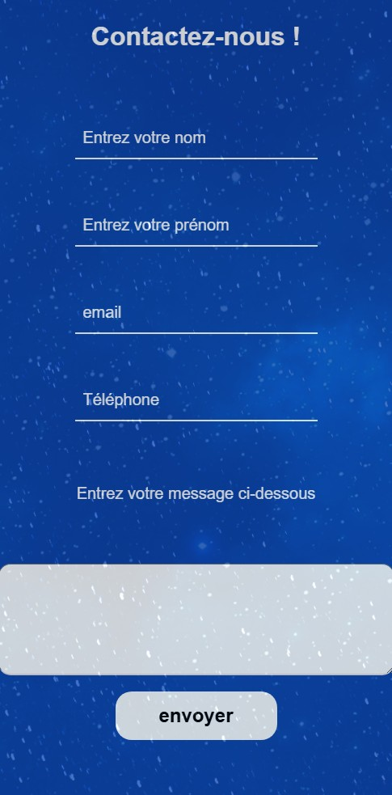
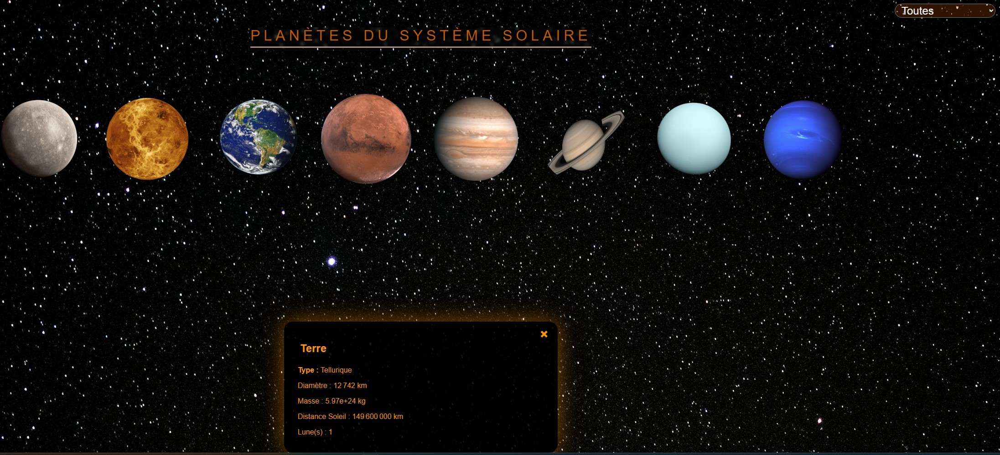
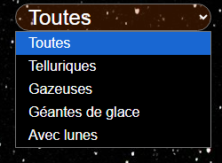

# SpaceNews – Projet fil rouge AFPA

## Description du projet

**SpaceNews** est un site web dédié à la publication d’articles d’actualité liés à l’astronomie et au domaine spatial.  
Ce projet est réalisé dans le cadre du **projet fil rouge**, avec pour objectif de mettre en pratique les bases du développement web sur la partie front-end.

---

## Compétences visées

### HTML
- Structurer une page web de manière sémantique
- Organiser le contenu (titres, sections, articles, images)
- Mettre en place une navigation claire

### CSS
- Mettre en forme une interface web
- Utiliser Flexbox et/ou Grid
- Gérer le positionnement des éléments
- Adapter l’affichage aux différents écrans (responsive design)

### JavaScript
- Manipuler le DOM
- Gérer les événements utilisateur (`addEventListener`)
- Utiliser des conditions (`if / else`)
- Utiliser des boucles (`for`, `forEach`)
- Charger et exploiter des données au format JSON

---

## Captures d’écran / Démonstrat

- ### Le formulaire

---
- ### Le planétarium

---
- ### Tri des planètes

